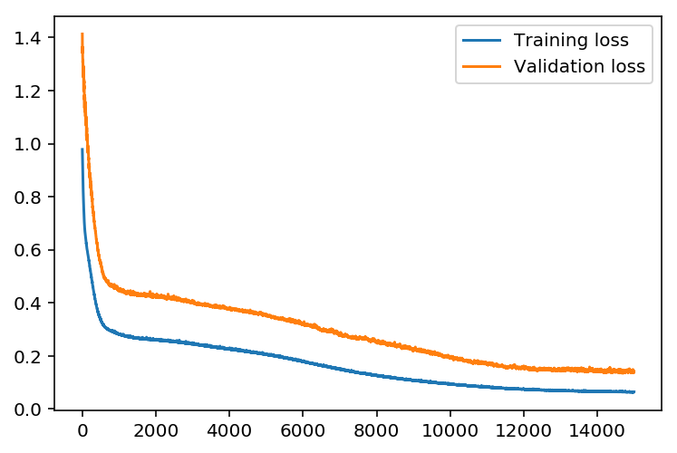
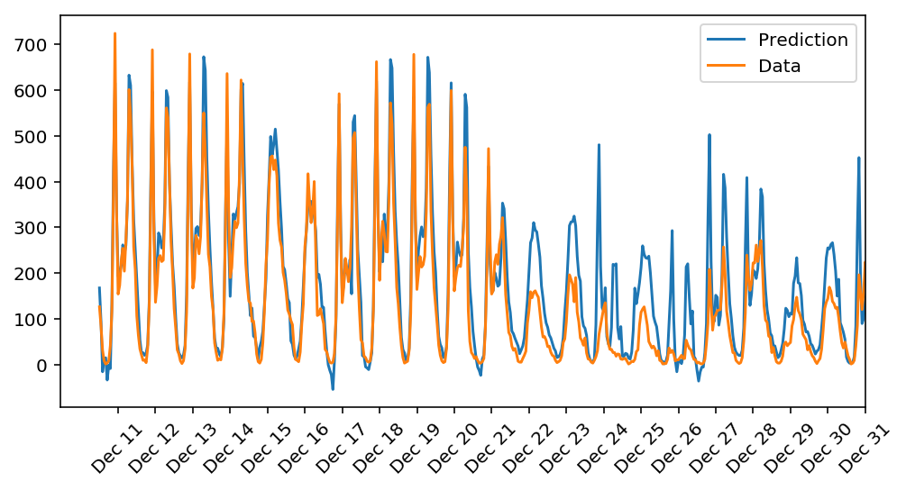

# Bike-Sharing-Prediction
## Referenced Bike Sharing Data set problem 
by Hadi Fanaee-T, Laboratory of Artificial Intelligence and Decision Support (LIAAD), University of Porto

**Background**
Bike sharing systems are new generation of traditional bike rentals where whole process from membership, rental and return 
back has become automatic. Through these systems, user is able to easily rent a bike from a particular position and return 
back at another position. Currently, there are about over 500 bike-sharing programs around the world which is composed of 
over 500 thousands bicycles. Today, there exists great interest in these systems due to their important role in traffic, 
environmental and health issues. 

Apart from interesting real world applications of bike sharing systems, the characteristics of data being generated by
these systems make them attractive for the research. Opposed to other transport services such as bus or subway, the duration
of travel, departure and arrival position is explicitly recorded in these systems. This feature turns bike sharing system into a virtual sensor network that can be used for sensing mobility in the city. Hence, it is expected that most of important events in the city could be detected via monitoring these data.

**Data Set**
Bike-sharing rental process is highly correlated to the environmental and seasonal settings. For instance, weather conditions, precipitation, day of week, season, hour of the day, etc. can affect the rental behaviors. The core data set is related to the two-year historical log corresponding to years 2011 and 2012 from Capital Bikeshare system, Washington D.C., USA which is publicly available in http://capitalbikeshare.com/system-data. We aggregated the data on two hourly and daily basis and then extracted and added the corresponding weather and seasonal information. Weather information are extracted from http://www.freemeteo.com. 

**Associated tasks**
- Regression: 
	Predication of bike rental count hourly or daily based on the environmental and seasonal settings.
- Event and Anomaly Detection:  
	Count of rented bikes are also correlated to some events in the town which easily are traceable via search engines.
	For instance, query like "2012-10-30 washington d.c." in Google returns related results to Hurricane Sandy. Some of the important events are identified in [1]. Therefore the data can be used for validation of anomaly or event detection algorithms as well.

**Data set**
This dataset has the number of riders for each hour of each day from January 1 2011 to December 31 2012. The number of riders is split between casual and registered, summed up in the cnt column. Looking at the data characteristics, there are information about temperature, humidity, and windspeed, all of which are likely affecting the number of riders. 
- hour.csv : bike sharing counts aggregated on hourly basis. Records: 17379 hours
- day.csv - bike sharing counts aggregated on daily basis. Records: 731 days

**Dataset characteristics**	
Both hour.csv and day.csv have the following fields, except hr which is not available in day.csv
* instant: record index
* dteday : date
* season : season (1:springer, 2:summer, 3:fall, 4:winter)
* yr : year (0: 2011, 1:2012)
* mnth : month ( 1 to 12)
* hr : hour (0 to 23)
* holiday : weather day is holiday or not (extracted from http://dchr.dc.gov/page/holiday-schedule)
* weekday : day of the week
* workingday : if day is neither weekend nor holiday is 1, otherwise is 0.
* weathersit : 
	- 1: Clear, Few clouds, Partly cloudy, Partly cloudy
	- 2: Mist + Cloudy, Mist + Broken clouds, Mist + Few clouds, Mist
	- 3: Light Snow, Light Rain + Thunderstorm + Scattered clouds, Light Rain + Scattered clouds
	- 4: Heavy Rain + Ice Pallets + Thunderstorm + Mist, Snow + Fog
* temp : Normalized temperature in Celsius. The values are divided to 41 (max)
* atemp: Normalized feeling temperature in Celsius. The values are divided to 50 (max)
* hum: Normalized humidity. The values are divided to 100 (max)
* windspeed: Normalized wind speed. The values are divided to 67 (max)
* casual: count of casual users
* registered: count of registered users
* cnt: count of total rental bikes including both casual and registered
	
**Reference**
[1] Fanaee-T, Hadi, and Gama, Joao, "Event labeling combining ensemble detectors and background knowledge", Progress in Artificial Intelligence (2013): pp. 1-15, Springer Berlin Heidelberg

## Network Architecture 

The network has two layers, a hidden layer and an output layer. The hidden layer use the sigmoid function for activations. The output layer has only one node and is used for the regression, the output of the node is the same as the input of the node. The activation function takes the input signal and generates an output signal, but takes into account the threshold, is sigmoid activation function here. 
> 15 hidden nodes and 1 output nodes with Sigmoid activation function
```python
self.activation_function = lambda x : 1 / (1 + np.exp(-x))
```
### Forward Propagation  
All of the outputs from one layer become inputs to the neurons on the next layer

### Backwpropagation
In this neural network , the weights propagates signals forward from the input to the output layers. Also, the weights propagates error backwards from the output back into the network to update previous weights. 
* Batch Weight Change
* Updating the weights : Updates on gradient descent step to both the input-to-hidden and hidden-to-output weights

### Hyperparameter Tuning
The strategy is to find hyperparameters such that the error on the training set is low, but avoiding overfitting to the data. 
- If network has too many hidden nodes, it can become overly specific to the training set and will fail to generalize to the validation set.
- The more iterations, the better the model will fit the data. However, this process can have sharply diminishing returns and can waste computational resources in case of too many iterations. So ideal number of iterations would be the network has a low training loss, and the validation loss is at a minimum. The ideal number of iterations would be a level that stops shortly after the validation loss is no longer decreasing. 
- Regarding to learning rate, if this is too big, the weights tend to explode and the network fails to fit the data. The lower the learning rate, the smaller the steps are in the weight updates and the longer it takes for the neural network to converge.   

> * Number of epochs: 15000 , Tried between 50 and 15000
> * Number of hidden units: 15, Tried between 5 and 100
> * Learning rate: 0.15, Tried between 0.05 and 5
> * Output nodes: 1 There is only one output needed 

Experimented changing each hyperparameter exclusively. When increasing epochs, the loss decreases though, I've tried to optimize the difference between training loss and validation loss would be the minimal. The bigger epochs could fall into overfitting, the bigger hidden units as well. To generalize model, I chose hidden units 15 to make the model more general to avoid overfitting. Bigger learning rate can fall into osciating results, so that I tried smaller learning rates. 

### Final Results
The training loss is below 0.09 and the validation loss is below 0.18. Here are the performance graph of training loss and validation loss.

## Test Result Summary 
|                          Test Result Summary                           |
|------------------------------------------------------------------------|
| Produces good results when running the network on full data            |
| The activation function is a sigmoid                                   |
| The backpropagation implementation is correct                          |
| The forward pass implementation is correct                             |
| The learning_rate is reasonable                                        |
| The number of epochs is reasonable                                     |
| The number of hidden nodes is reasonable                               |
| The number of output nodes is correct                                  |
| The run method is correct                                              |
| The update_weights implementation is correct                           |
| The weights are updated correctly on training                          |

## Prediction result

The test data set is the last approximately 21 days to predict and comapred with actual data record which is data from Dec11 , 2012 to Dec 31 2012. Regarding to miss predicting data, there is a strong correlation between bike renting and seansoal data such as weather or holiday season. From Dec 22 to Dec 31, especially it's Christmas season, and data does not show similar pattern before/after Dec. 22. However, prediction model is trained/optimized based on normal days so that, unusual/unseen pattern cannot be accurately predictable. To improve this model,"holiday" value from two csv files should be adjusted before christmas till new years day or "seasonint" value should be adjusted to reflect "special holiday seanson" from Chirstmas even to New Years Eve. Further more At least a couple more years data collection would be helpful to predict christmas holiday rental pattern.
